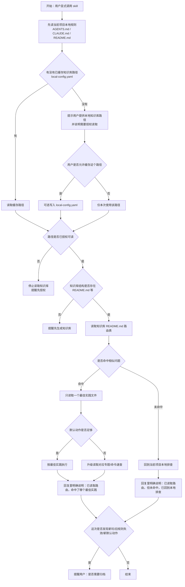

# ai-collaboration-retro-skill

English version: [readme_en.md](readme_en.md)

`ai-collaboration-retro` 是一个通用的 AI 协作复盘 skill。它不是帮你再多写一份复盘，而是把你自己项目里真实踩过、验证过、复盘过的经验，整理成 AI 可复用的项目记忆。

它的目标很直接：让 AI 在后续协作时少重复踩坑，少发错误或多余请求，少读无关上下文，降低 token 消耗。

## 它解决什么问题

很多团队已经有复盘、笔记、命令、经验总结，但 AI 接手任务时还是经常不知道：

- 先读当前项目规则，还是先读复盘库
- 哪些内容是默认动作，哪些只是历史案例
- 这次问题有没有现成经验可复用
- 发现新坑后，要不要顺手归档

这个 skill 解决的不是“文档不够多”，而是“AI 不知道先读什么、怎么少读、怎么命中对的经验”。

## 3 个场景

- `先查现成经验`
  我要做这件事，先看看自己项目里有没有已经验证过的经验。
- `生成或整理知识库`
  把自己授权项目里的真实经验提炼成 AI 可复用知识库。
- `审查或归档更新`
  检查知识库结构是否合理，并决定新坑该补到哪里。

## 仓库结构

```text
ai-collaboration-retro-skill/
|-- LICENSE
|-- README.md
|-- readme_en.md
`-- ai-collaboration-retro/
    |-- local-config.example.yaml
    |-- SKILL.md
    `-- agents/
        `-- openai.yaml
```

## 安装

把 `ai-collaboration-retro/` 整个目录复制到你使用的 AI 工具 `skills/` 目录，或者直接把 `SKILL.md` 当通用提示词使用。

常见位置：

- Windows: `%USERPROFILE%\.codex\skills\`
- macOS/Linux: `~/.codex/skills/`

示例：

```powershell
git clone https://github.com/lllzzz1315/ai-collaboration-retro-skill.git
Copy-Item -Recurse .\ai-collaboration-retro-skill\ai-collaboration-retro $env:USERPROFILE\.codex\skills\
```

```bash
git clone https://github.com/lllzzz1315/ai-collaboration-retro-skill.git
cp -R ./ai-collaboration-retro-skill/ai-collaboration-retro ~/.codex/skills/
```

## 首次使用

这个 skill 现在走“先问路径，再决定是否缓存”的方式，尽量降低使用门槛。

首次触发时，理想交互应该像这样：

```text
这次要用哪个本地知识库路径？把路径发我就行。
注意：这个路径需要你授权 AI 可读。
如果你愿意，我也可以把它记成下次默认路径。
```

如果该路径下还没有知识库结构，就继续提示：

```text
这个路径下还没有现成知识库。要不要先按这套规则帮你生成一份基础结构？
```

也就是说，`local-config.yaml` 不是前置必需项，而是可选缓存。

## 可选缓存配置

如果你希望下次直接复用知识库路径，可以保存：

```text
~/.codex/skills/ai-collaboration-retro/local-config.yaml
```

模板文件：

```text
~/.codex/skills/ai-collaboration-retro/local-config.example.yaml
```

示例：

```yaml
knowledge_base:
  path: "D:/Obsidian-Project/Obsidian/04_AI协作复盘"
  expected_entry: "README.md"
  requires_authorized_read: true
```

## 超短提示词

更顺手的说法，建议直接用这 3 句：

```text
我要做这件事，先用 $ai-collaboration-retro 查一下有没有现成经验。
```

```text
我要把这个项目沉淀成经验库，先用 $ai-collaboration-retro 帮我整理。
```

```text
这个新坑帮我看看该归档到哪里，先用 $ai-collaboration-retro 走一下。
```

## 提示词示例

1. 先查现成经验

```text
我要做这件事，先用 $ai-collaboration-retro 查一下有没有现成经验；如果命中，告诉我这次有没有读路由、命中了哪个最佳实践。
```

2. 生成或整理知识库

```text
我要把我自己授权的本地项目整理成经验库。先用 $ai-collaboration-retro 读取项目，提炼真实踩过的坑和验证过的经验；这个过程只在本地进行，不上传网络。
```

3. 审查或归档更新

```text
我要审查这份知识库，顺便看看这次新坑该补到哪里；如果值得复用，提醒我归档。
```

## 本地建库提示词

```text
我要把我自己授权的本地项目整理成 AI 可复用知识库。请先用 $ai-collaboration-retro 读取这些项目里真实踩过、验证过的经验，生成或更新知识库。这个过程只读取本地授权内容，不上传网络。如果这次还没有知识库路径，就先提示我提供；如果路径下还没有知识库结构，就先帮我生成基础结构。
```

## 目标输出结构

```text
README.md              路由表，只负责指路
最佳实践_xx.md         一类问题一个短文件，只写默认动作
专题/专题_xx.md        现象、根因、案例、预防
命令速查.md             只放可复制命令
基线定义文档/            可复用 AGENTS / CLAUDE / 项目基线
```

## 路由例子

下面这个流程图表示：当你显式调用这个 skill 去处理一个任务时，AI 应该怎么决定先读什么、再读什么。



## 使用边界

- 只读取用户明确授权的本地项目和本地知识库。
- 它的重点是少读、准读，不是全量扫描。
- 它不替代当前项目规则；真实工作时，仍然先读当前项目自己的规则文件。
- 它沉淀的是“你自己项目里真实发生过并已验证过的经验”，不是泛泛的通用坑位大全。

## License

MIT. See [LICENSE](LICENSE).
