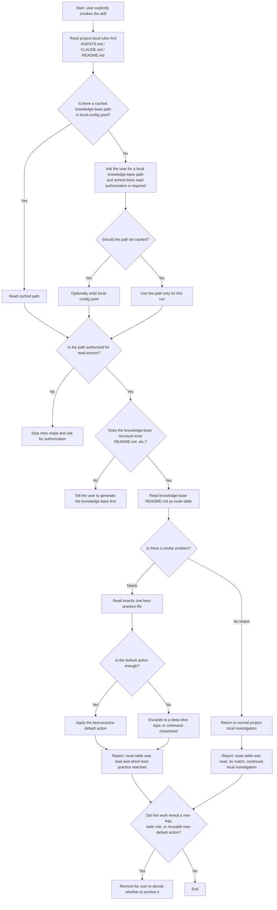

# ai-collaboration-retro-skill

Chinese version: [README.md](README.md)

`ai-collaboration-retro` is a general AI collaboration retrospective skill. It does not try to create one more retrospective document. It turns the lessons your own projects already paid for into reusable project memory for future AI work.

The goal is simple: help AI avoid repeating known mistakes, send fewer wrong or redundant requests, read less irrelevant context, and spend fewer tokens.

## What Problem It Solves

Many teams already have notes, retros, commands, and lessons. The problem is that a new AI session still does not know:

- what to read first,
- which file is the default-action guide,
- which file is just historical context,
- whether this task already has a proven route,
- whether a newly discovered trap should be archived back.

This skill is not about writing more documentation. It is about teaching AI how to read less, route faster, and reuse lessons from your own verified project history.

## Three Scenarios

- `Check existing lessons first`
  Before doing the task, see whether your project memory already has a reusable lesson.
- `Generate or reorganize the knowledge base`
  Turn lessons from authorized local projects into reusable AI-facing memory.
- `Audit or archive updates`
  Review whether the structure is still good and decide where a new lesson belongs.

## Repository Layout

```text
ai-collaboration-retro-skill/
|-- LICENSE
|-- README.md
|-- readme_en.md
`-- ai-collaboration-retro/
    |-- local-config.example.yaml
    |-- SKILL.md
    `-- agents/
        `-- openai.yaml
```

## Install

Copy the full `ai-collaboration-retro/` folder into your AI tool's `skills/` directory, or use `SKILL.md` directly as a reusable prompt/instruction file.

Common locations:

- Windows: `%USERPROFILE%\.codex\skills\`
- macOS/Linux: `~/.codex/skills/`

Example:

```powershell
git clone https://github.com/lllzzz1315/ai-collaboration-retro-skill.git
Copy-Item -Recurse .\ai-collaboration-retro-skill\ai-collaboration-retro $env:USERPROFILE\.codex\skills\
```

```bash
git clone https://github.com/lllzzz1315/ai-collaboration-retro-skill.git
cp -R ./ai-collaboration-retro-skill/ai-collaboration-retro ~/.codex/skills/
```

## First Use

This skill now uses an ask-first flow to keep first use simple.

The ideal first interaction should feel like this:

```text
Which local knowledge-base path should I use for this run? Just send me the path.
Note: that path must be authorized for AI read access.
If you want, I can also save it as the default path for next time.
```

If the path does not contain a ready knowledge base, continue with:

```text
There is no ready knowledge base at that path yet. Should I generate the base structure first?
```

So `local-config.yaml` is optional convenience, not a hard prerequisite.

## Optional Cached Config

If you want to reuse the same knowledge-base path next time, save:

```text
~/.codex/skills/ai-collaboration-retro/local-config.yaml
```

Template:

```text
~/.codex/skills/ai-collaboration-retro/local-config.example.yaml
```

Example:

```yaml
knowledge_base:
  path: "D:/Obsidian-Project/Obsidian/04_AI协作复盘"
  expected_entry: "README.md"
  requires_authorized_read: true
```

## Short Prompt Cheatsheet

These three are the most natural starting prompts:

```text
I want to do this task. Use $ai-collaboration-retro first and check whether we already have a reusable lesson.
```

```text
I want to turn this project into a reusable memory base. Use $ai-collaboration-retro first and organize it.
```

```text
Help me decide where this new lesson should be archived. Use $ai-collaboration-retro first.
```

## Prompt Examples

1. Check existing lessons first

```text
I want to do this task. Use $ai-collaboration-retro first, check whether we already have a reusable lesson, and tell me whether the route table was read and which best-practice file matched.
```

2. Generate or reorganize the knowledge base

```text
I want to turn my authorized local projects into a reusable memory base. Use $ai-collaboration-retro to extract real project lessons and verified practices. Keep the whole process local and do not upload anything to the network.
```

3. Audit or archive updates

```text
I want to review this knowledge base and decide where this new trap belongs. Use $ai-collaboration-retro first, and remind me if it should be archived.
```

## Local Knowledge-Base Prompt

```text
I want to turn my own authorized local projects into reusable AI knowledge. Use $ai-collaboration-retro to read only local authorized content, extract lessons that really happened and were already verified, and generate or update the knowledge base. If there is no knowledge-base path yet, ask me for one first. If the path exists but the knowledge base is not ready, generate the base structure first.
```

## Expected Output Structure

```text
README.md              route table only
best-practice_xx.md    one short file per problem type
topics/topic_xx.md     symptoms, root cause, case, prevention
command-cheatsheet.md  copyable commands only
baselines/             reusable AGENTS / CLAUDE / project baselines
```

## Routing Example

This flow shows what the skill should do when the user explicitly invokes it for a task.



## Boundaries

- Read only projects and knowledge-base paths the user explicitly authorizes.
- The point is selective reading, not full-repo scanning.
- It does not replace the current project's own rules.
- The knowledge base should capture lessons from your own projects, not a generic catalog of common mistakes.

## License

MIT. See [LICENSE](LICENSE).
